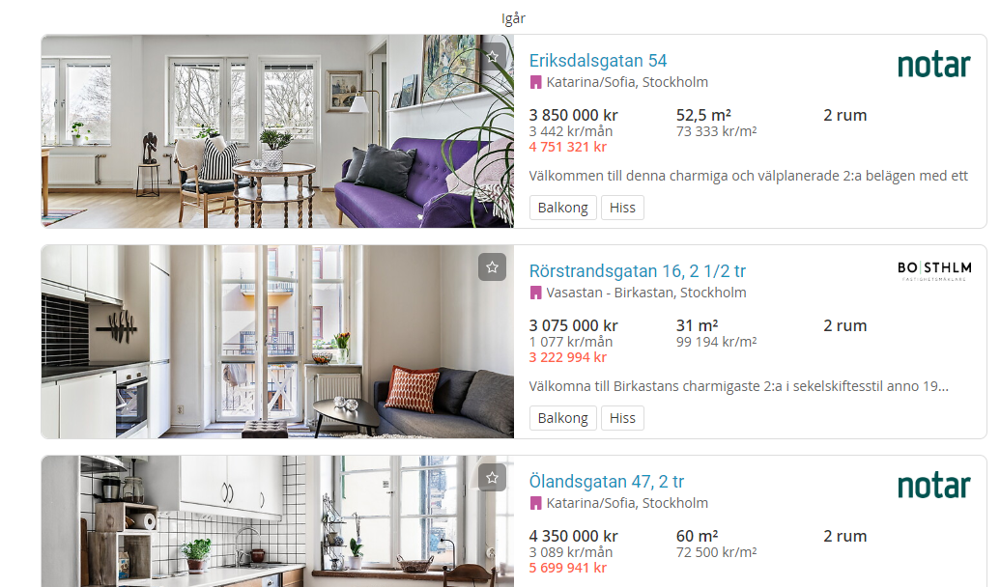
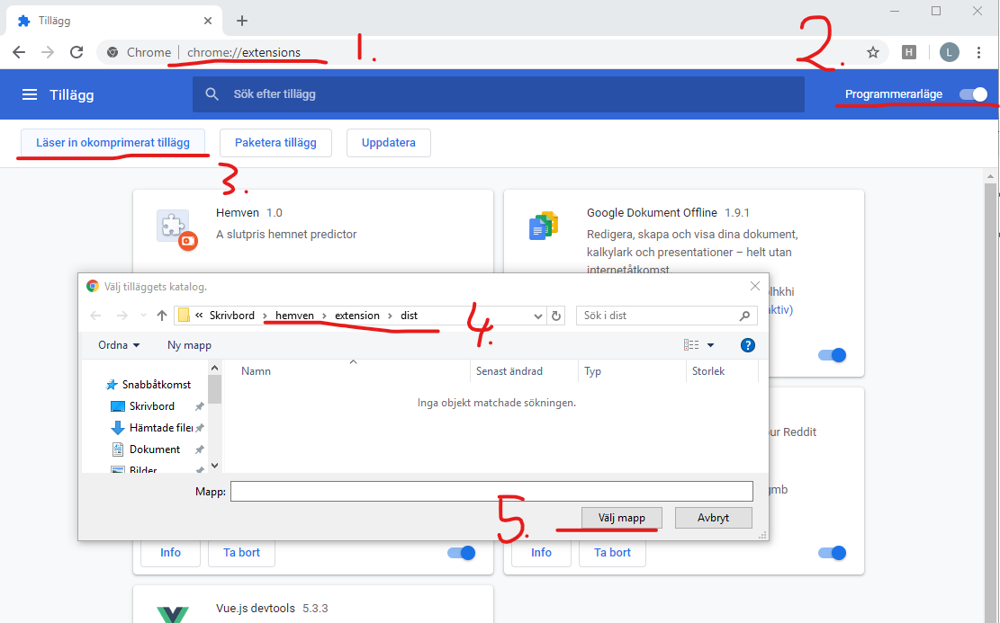

# hemven
The hemven project consists of
1. Data collection
2. Creating an ML Model
3. Deploying model with a REST API
4. Chrome extensions to get predictions when browsing hemnet.se

## Installing Chrome Extension
